## Prerequisites:
- In your BTP sub account,you have [initially set up you SAP Business Application Studio(BAS)](https://help.sap.com/docs/bas/sap-business-application-studio/getting-started) and created Dev Space in Full Stack Cloud Application.

## Steps:

- Step 1,  Change folder to Projects in BAS

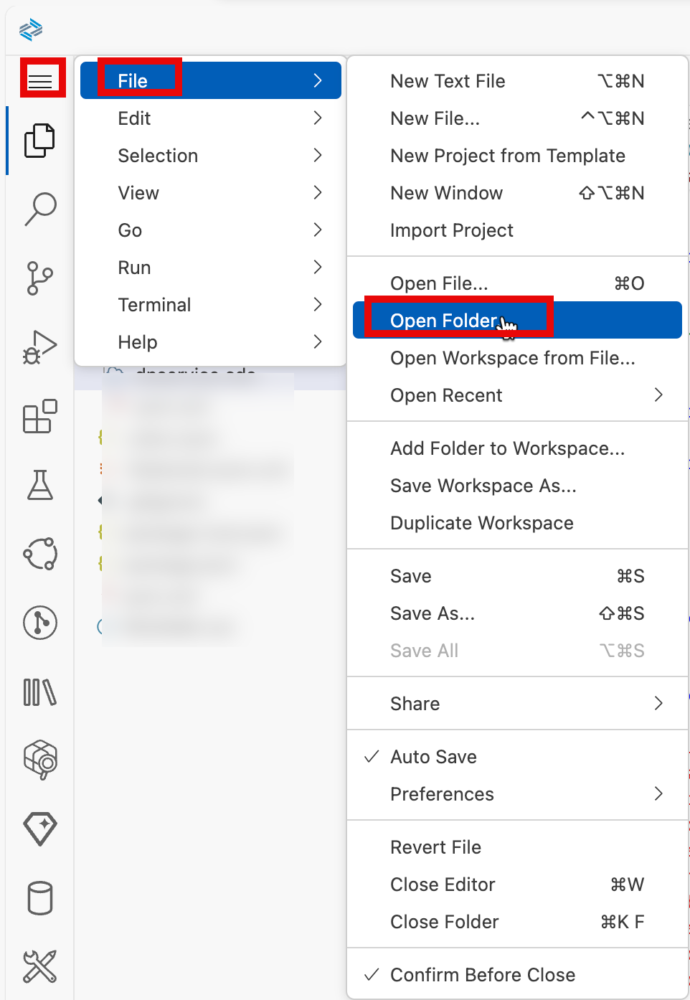
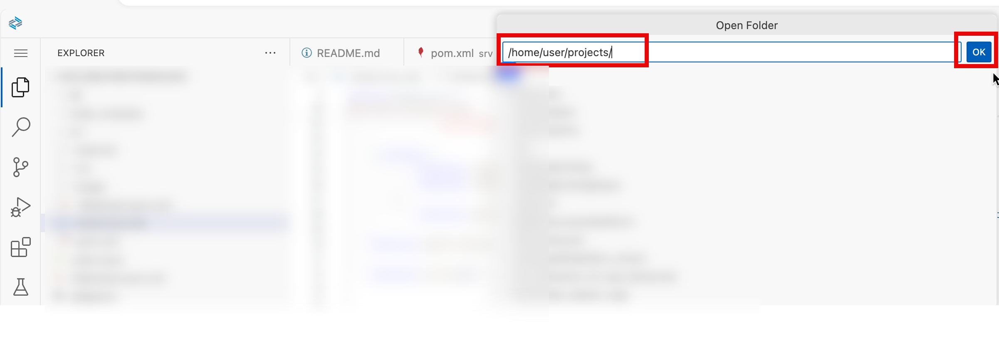

- Step 2, Clone code from git hub.
Run the following command in BAS terminal:
```bash
git clone https://github.com/horsemanjackyliu/labelprintinginjava.git
```
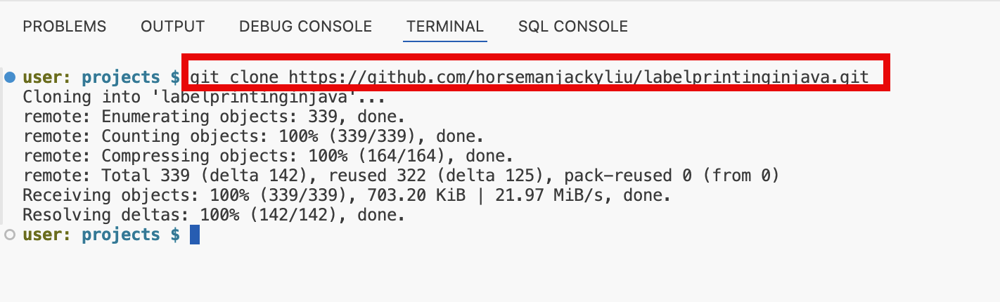

- Step 3, Build the application with the following command in BAS terminal:
```bash
cd labelprintinginjava
mvn clean install
npm run build
```
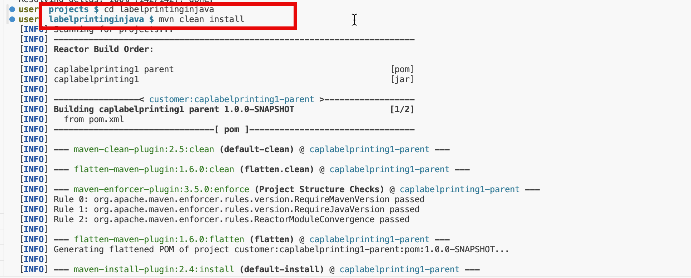
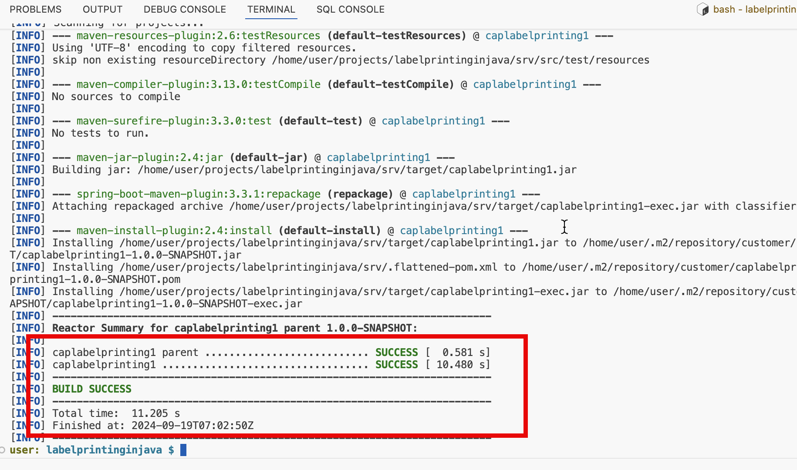
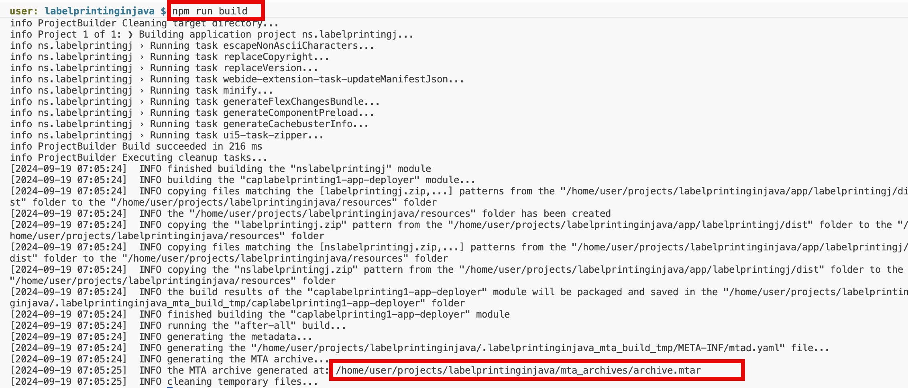


- Step 4, login into BTP SubAccount with the following command in BAS terminal:
```bash
cf login -a <cloud foundry api>
```

You can get the cloud foundry API in BTP SubAccount with the following screenshot:
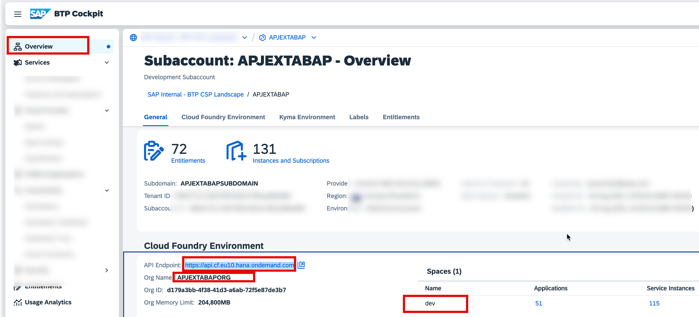
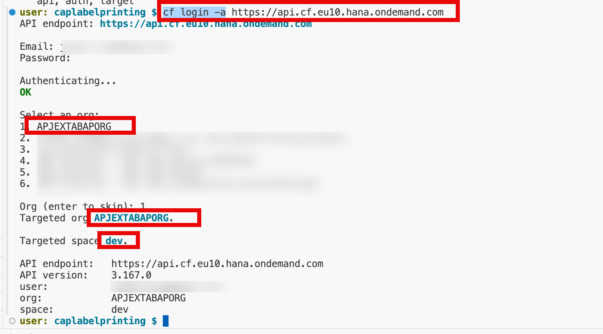

- Step 5, Run the following command in BAS terminal to deploy the application into BTP SubAccount cloud foundry environment .

```bash
npm run deploy
```
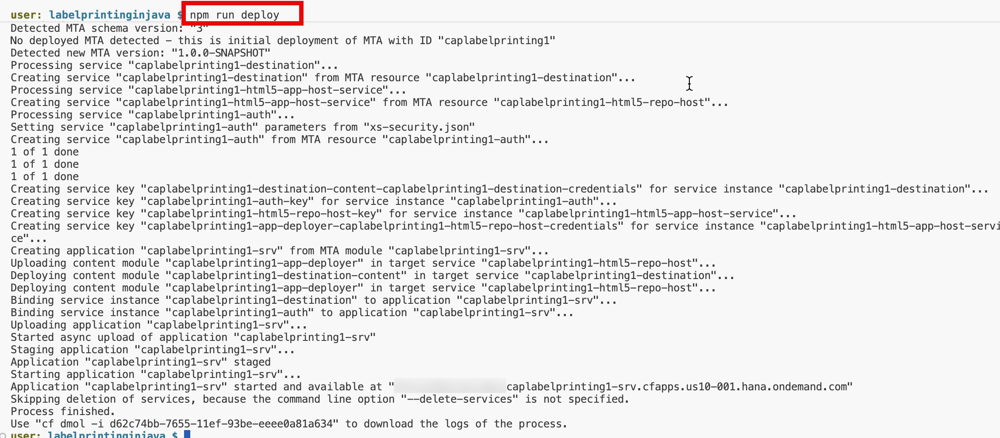


- Step 6, Create role collection and assign the role to the end user in BTP SubAccount.

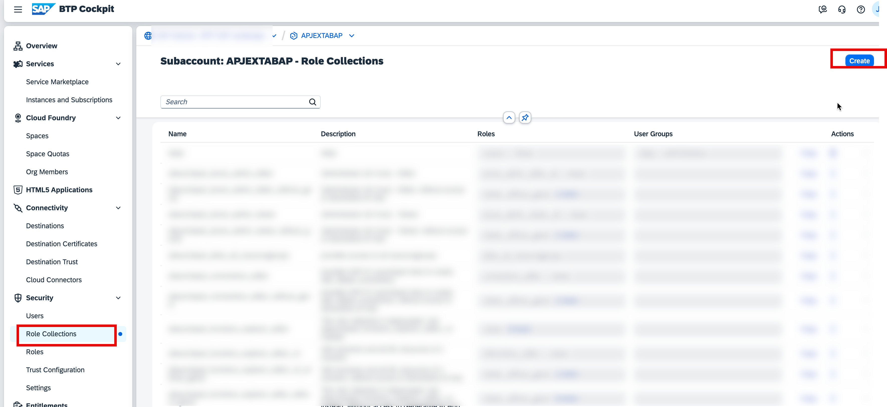
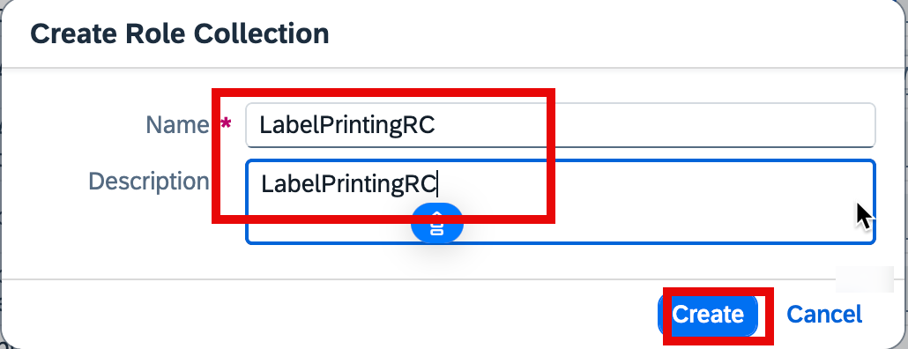
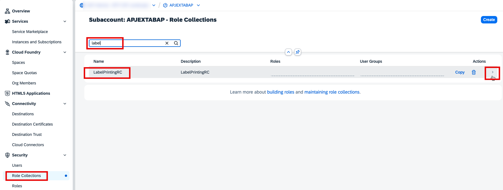
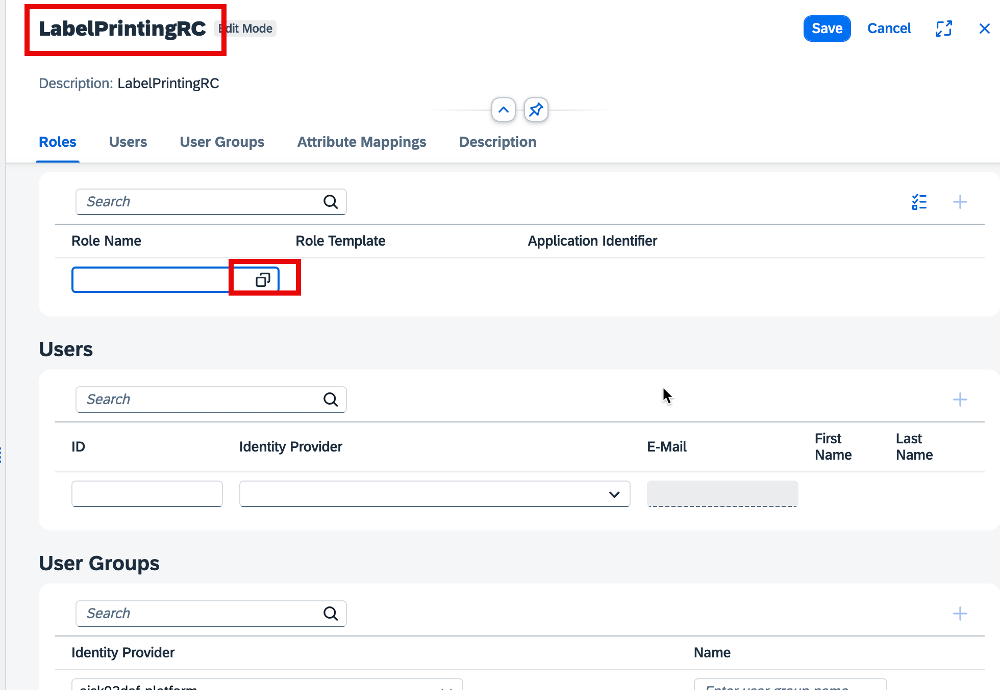
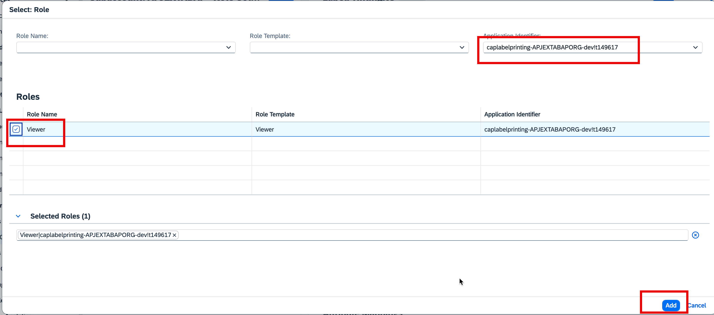
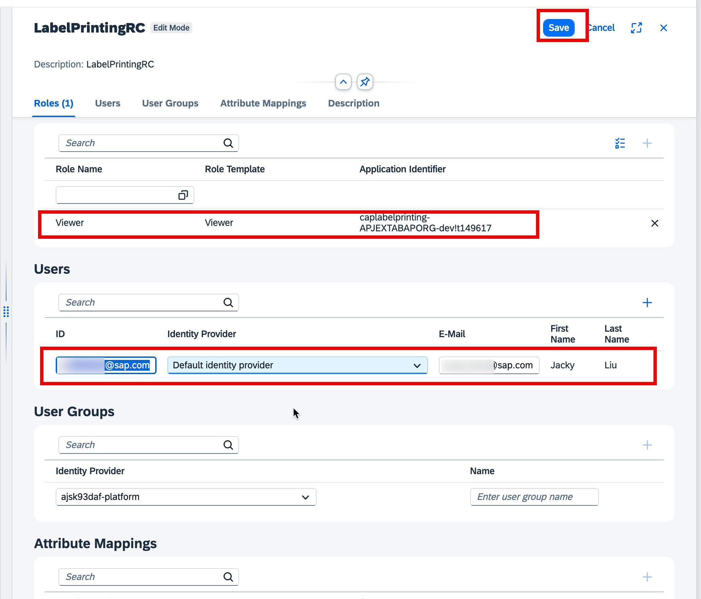


