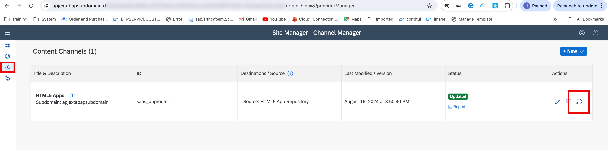
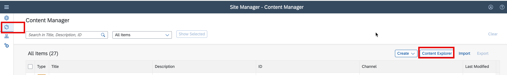
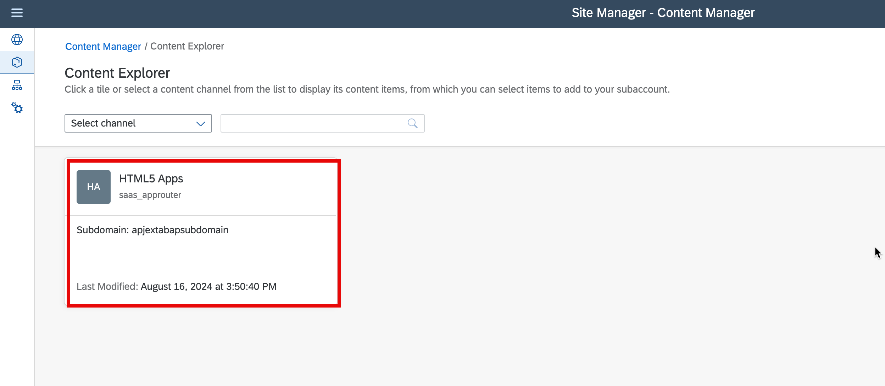
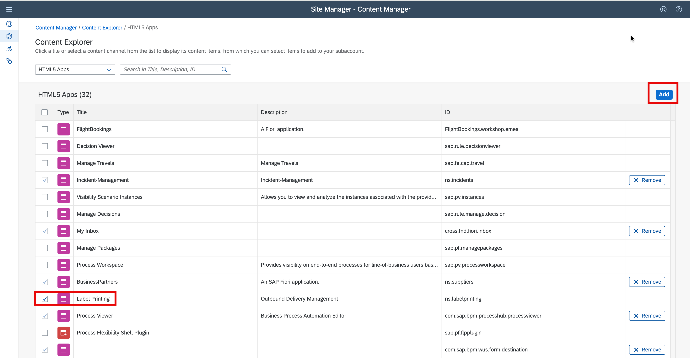
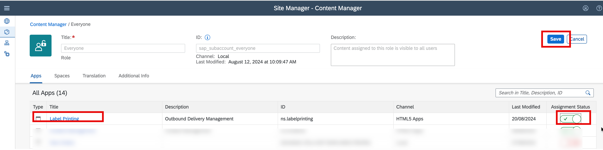
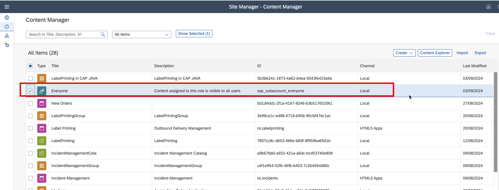
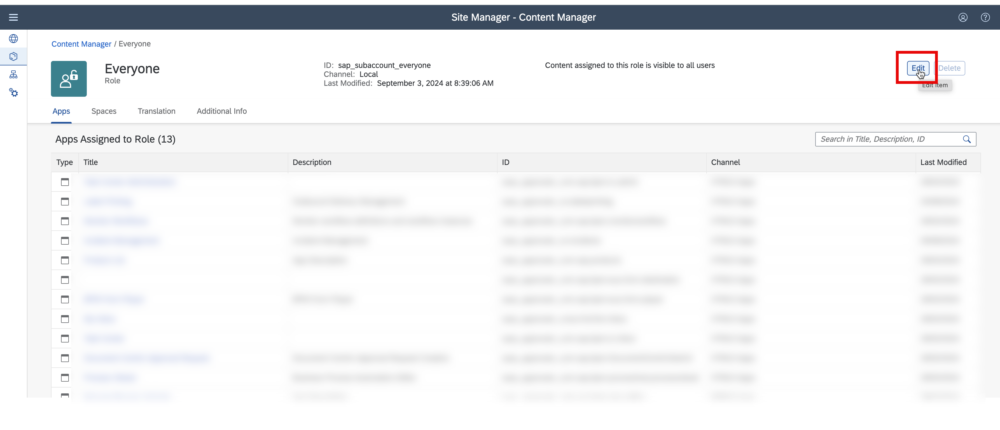
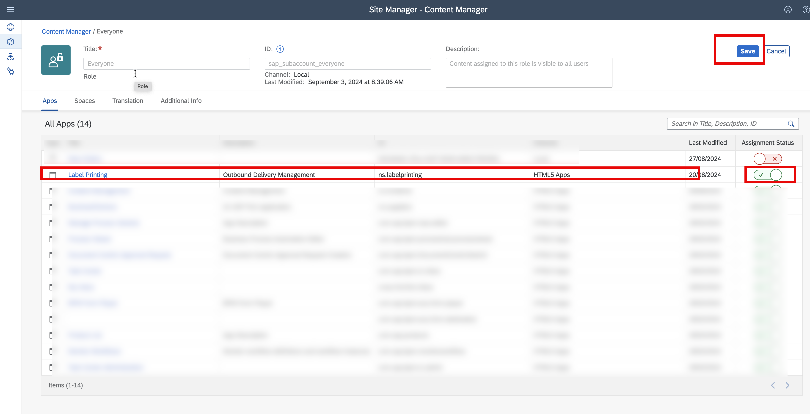
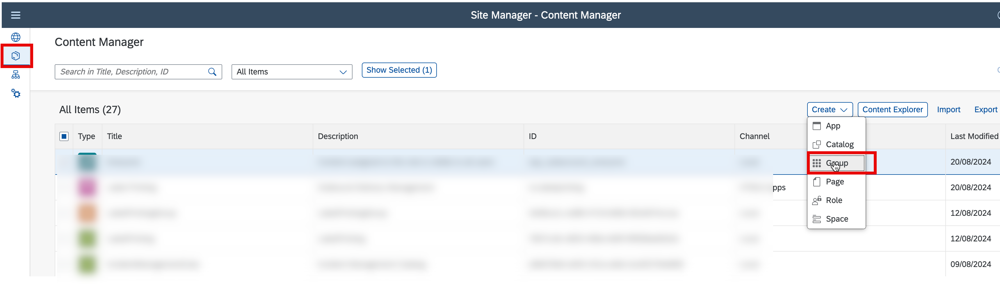
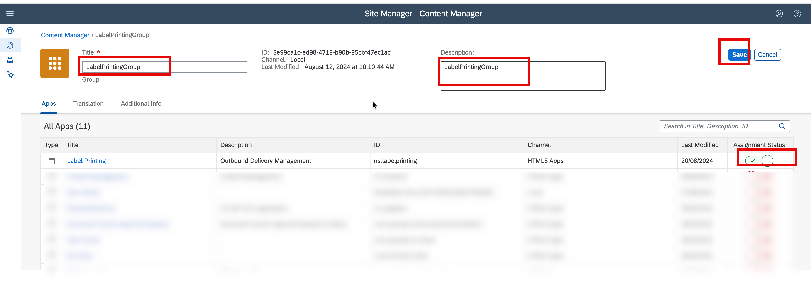

- Step 1, Refresh HTML5 Application in SAP Build Work Zone.

- Step 2, Assign the LabelPrinting application to everyone.

- Step 3,Create Group and Assign the LabelPrinting application to the new created Group.

