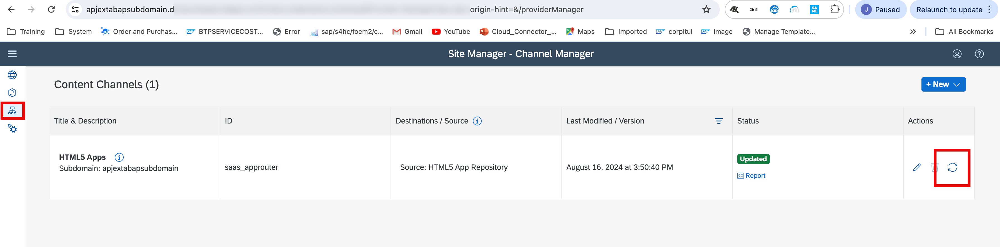
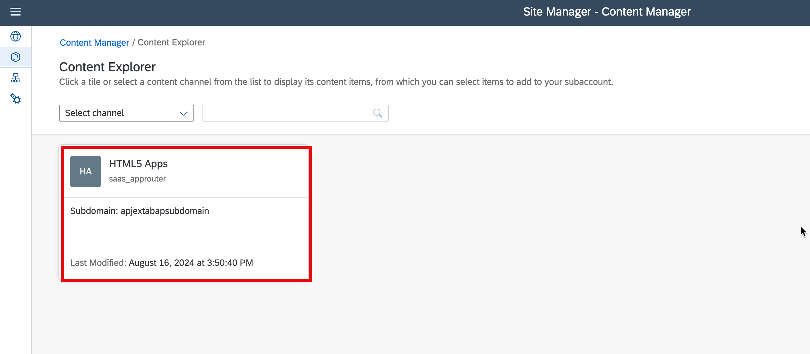
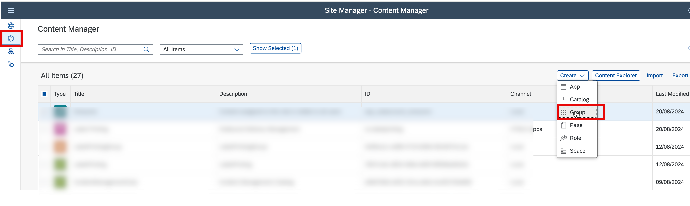

### Prerequisites

- You have subscribed to SAP Build Work Zone, standard edition and assigned yourself to the Launchpad_Admin role

### Steps:

- Step 1, Refresh HTML5 Application in SAP Build Work Zone.

- Step 2, Assign the LabelPrintingJava application to everyone.

- Step 3,Create Group and Assign the LabelPrintingJava application to the new created Group.

